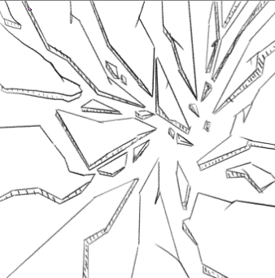
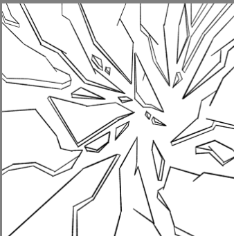
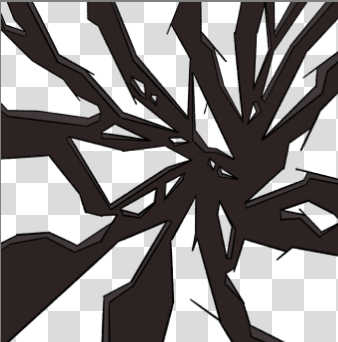
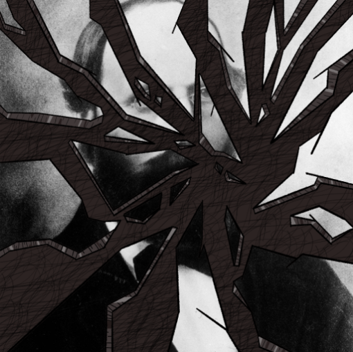
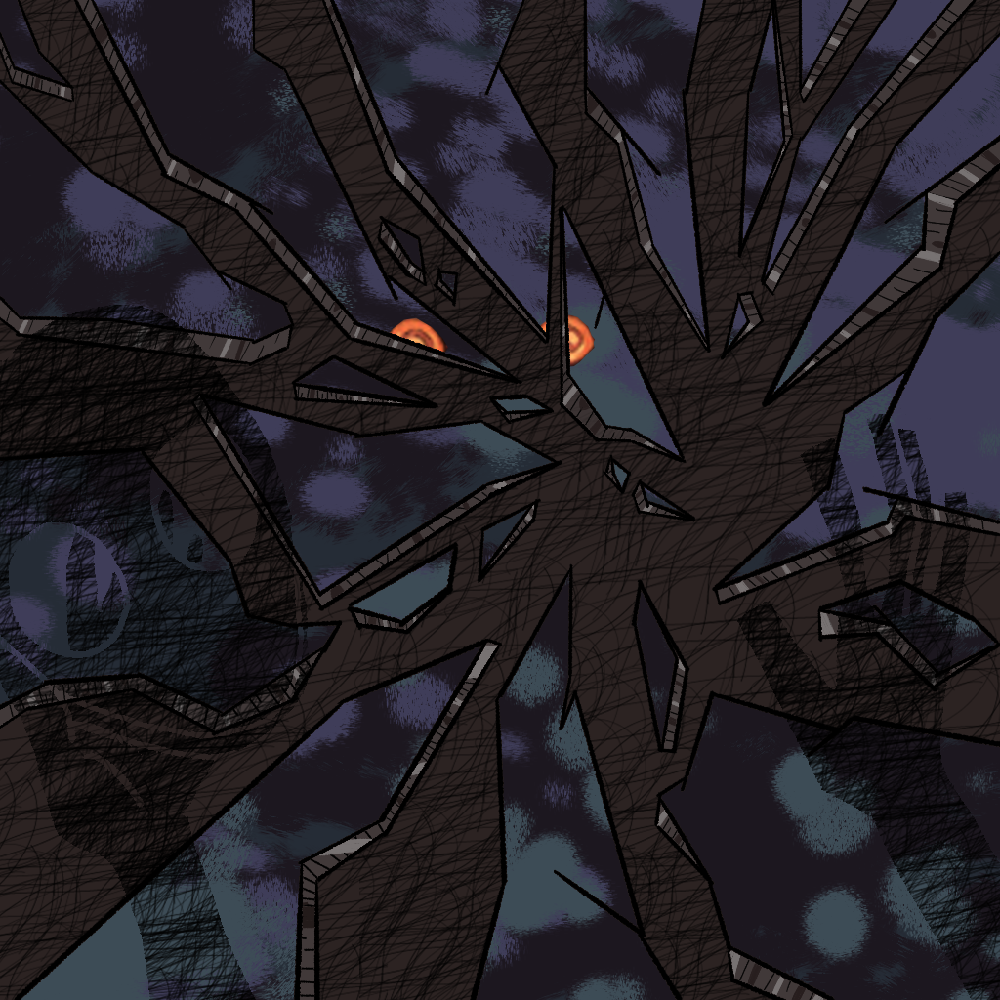

## Organized τι;

Yellow! Κατά τη διάρκεια του τελευταίου μήνα, από τις 15 Μαρτίου έως τις ~~15~~ 16 Απριλίου, εγώ και μερικοί φίλοι μου στο Discord αποφασίσαμε να διοργανώσουμε ένα "art jam". Σε αυτό, οι συμμετέχοντες μπορούσαν να υποβαλλουν ζωγραφιές, μίνι παιχνίδια ή διάφορα άλλα πράγματα που έχουν φτιάξει πάνω σε μια θεματική, που θα ορίζαμε.

Αυτή τη φορά, το θέμα ήταν η λέξη "metamorphosis". Είχαμε πολλές συμμετοχές από άτομα εντός και εκτός χώρας, οπότε ήταν μια ενδιαφέρουσα εμπειρία να κάνω moderate μια σχετικά μικρή ομάδα ατόμων και να δω πώς καθένας ερμήνευε το θέμα με τον δικό του ξεχωριστό τρόπο.

Παρόλο που στο τέλος δεν υπέβαλαν όλοι όσοι πήραν μέρος, υπήρχαν όμορφες παραδόσεις και θα σας πρότεινα να [επισκεφθείτε τη σελίδα](https://itch.io/jam/organized-chaos-jam/entries) του διαγωνισμού για να δείτε τι έκανε ο καθένας.
## Τι έκανα εγω:

Αρχικά, είχα σκεφτεί να δημιουργήσω ένα arg, το οποίο θα ξεκινούσε με το να κατεβάζεις μια εικόνα μιας κάμπιας. Καθώς προχωρούσες και ανακαλύπτεις στοιχεία, η εικόνα θα μεταβαλλόταν σταδιακά, μέχρι να αποκαλυφθεί στο τέλος μια πεταλούδα. Παρότι εξακολουθώ να πιστεύω ότι αυτή ήταν μια καλή ιδέα για ένα project, η έλλειψη χρόνου λόγω πανελλαδικών με εμπόδισε από το να την υλοποιήσω. Παρ' όλα αυτά, ενδέχεται να την αναπτύξω στο μέλλον και να την μοιραστώ εδώ.

Καθώς ο διαγωνισμός διήρκεσε έναν μήνα και είχα πολλή ύλη να καλύψω, ανέβαλα περαιτέρω πρόοδο στο project, Θεωρόντας ότι κατά τη διάρκεια του διαγωνισμού θα βρισκόμουν σε μια καλύτερη θέση και θα είχα τη δυνατότητα να το αντιμετωπίσω τότε.
## Και φυσικά ξέχασα την ύπαρξη του για 3 εβδομάδες...

Καθώς απομένανε μόλις ~~7~~ ~~6~~ ~~5~~ 4 ημέρες, για να φτιάξω κάτι αξιόλογο, κατέληξα στο συμπέρασμα ότι το γρηγορότερο πράγμα που μπορούσα να κάνω ήταν μία ζωγραφία. Δεδομένου ότι ο χρόνος μου ήταν περιορισμένος, άρχισα με μία γενική ιδεα, με την ελπίδα ότι, όσο προχωρούσα, το τελικό αποτέλεσμα θα έμοιαζε με.. Κατι?

Αρχικά, σκέφτηκα ότι ένας σπασμένος καθρέφτης, όπου τα κομμάτια του θα σχηματίζουν έναν γέρο χαρακτήρα και το κενό πίσω του θα αντιπροσώπευε τη νέα εκδοχή του, θα ήταν μια ενδιαφέρουσα ιδέα. Έτσι, ξεκίνησα με ένα βασικό σχέδιο ενός καθρέφτη.

Μετα απο αυτο καθαρισα τις γραμμες και εβαλα καποια βασικα χρομματα.

Εβαλα texture στο background και στα κομμάτια του καθρευτη

Και εδω ειναι που ειχαμε προβλημμα. Αφου τελειωσα ολα αυτα, μου ειχαν μεινει 60 λεπτα για να κανω τον χαρακτηρα, Εφοσον δεν μπορουσα απλα να ανεβασω τον καθρεπτη κενο. Αρα μεσα σε μια ωρα με 4 λεπτα περισεβομενα καταφερα να φτιαξω αυτο:

Εδώ είχαμε ένα πρόβλημμα. Αφού ολοκλήρωσα όλα αυτά, είχα μόνο 60 λεπτά για να δημιουργήσω τον χαρακτήρα. Δεδομένου ότι δεν ήταν εφικτό απλά να αφήσω τον καθρέφτη κενό, αναγκάστηκα να βρω λύση, και 4 λεπτά πρίν κλείσει ο διαγωνισμός, κατάφερα να δημιουργήσω αυτό:

Πρέπει να ομολογήσω ότι παρόλο που ήταν μια βιαστική ζωγραφιά, δεν είναι καθόλου άσχημη. Το εφέ του σπασμένου καθρέφτη φαίνεται πετυχημένο, και παρόλο που ίσως δεν κατάφερα να ολοκληρώσω εντελώς τον χαρακτήρα προς το τέλος, σκέφτομαι να επιστρέψω στο έργο μέσα στην επόμενη εβδομάδα για να του δώσω τις τελικές πινελιές που του αξίζουν. Ίσως όταν το κάνω αυτό, κάνω ένα edit σε αυτήν την ανάρτηση για να σας δείξω το πραγματικά τελικό αποτέλεσμα.

Θεωρητικά, θα διοργανώσουμε ξανά το Jam σε κάποιο σημείο μέσα στο καλοκαίρι, όταν θα έχουμε όλοι περισσότερο χρόνο, και εννοείται πως θα ήθελα να συμμετάσχω ξανά. Γενικά, πιστεύω πως αυτή ήταν μια διασκεδαστική εμπειρία που με έδωσε αφορμή να γράψω και την ανάρτηση για αυτή την εβδομάδα. Αυτά για την ώρα, και τα λέμε την επόμενη φορά! Cya!

### 𝓘𝓷𝓯𝓭𝓿
